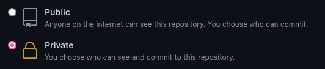

# Aviv Frontend Technical Test

## Presentation

This repository contains instructions for the Aviv - Owner - Frontend Technical Test.

Its objective is to give us an overview of your practical technical knowledge through the realisation of an application that matches what we do as Frontend Engineer at Aviv.

## Objective

The aim is to develop the client side code of an application allowing visualising of all the messages sent to a realtor agency based on a given API.

Messages can be of different types: email, text message, voicemail.

The app will be used by the agency collaborators.
Any collaborator can visualise the messages for one or several agencies to which they are attached to.

This test is a simplified version of one of our existing application.

When you are done, there's a few questions to answer in the [SOLUTION.md](SOLUTION.md) document.

## How to start the test

This repository being a template, it's possible to create a new project using this one as a [template](https://github.com/MeilleursAgents/frontend-technical-test/generate). Check the big green `Template` button. Thanks to let the generated project as a private one.

Alternatively, you can always clone this repository.

    git clone git@github.com:MeilleursAgents/frontend-technical-test.git

## Restitution

When you are happy with the result of your test, and if you already applied, please send a `.zip` of the **complete** repository (minus the `node_modules` folder) to the tech recruiter that sent you the test using "Reply all".

If you haven't applied yet, you can send us your technical test to the following email address with your coordinates and/or your CV: frontend-technical-test@meilleursagents.com

One of our tech recruiters will then be in touch with you for an interview while your test is being reviewed.

If your test meets our criteria to get to the next step, you will subsequently meet one of our managers alongside a couple of developers to debrief your technical test, during an hour long session of demo/code review where we will talk about your test, your career, and motivations to join us.

⚠️ CVs alone are not allowed to this email address. To apply, all our job offers are available on our [LinkedIn page](https://www.linkedin.com/jobs/search/?currentJobId=3213565461&f_C=19180346%2C252717%2C2802577%2C318363%2C265656&geoId=92000000).

## Completion time

The time you spend on this test is not limited. The idea is to take your time, respect the assignment, and send us the result when you are happy with it.

## Logical and technical functionnalities

### Required for the test presentation step

**Product functionnalities:**

- I can switch agencies via both the select and the URL and I see the messages list for the selected agency.
- I can scroll through the messages list on several pages regardless of the screen size.
- I can click on a message and open the message details.
- If the message wasn't read, the counter decrements

**Technical implementation:**

- Develop the small and large screen version
- Develop the agency switch mecanism via both a native HTML select and the URL (routing)
- Develop the agency view with the messages list
- Develop the possibility to read a message through the URL (routing)
- Respect the routing structure `/realtors/:id` and `/realtors/:id/messages/:id`
- Handle the unread message counter (send a request to the API to make the value persist)
- Handle the pagination (infinite scroll)
- Respect the mockup fidelity

### Appreciated with the implementation

⚠️ Those are expected for the Senior and Principal Engineer positions

- Unit and functionnal tests: a 100% coverage is not necessary, just make them pertinent
- Good accessibility practices
- Relative dates on the messages list e.g. "Yesterday", "Two hours ago"

### Technical constraints

- Use a JS library/framework
- Use the provided API
- Develop the application in the `front` folder

### Technical liberties

- Use of tooling, CSS alternatives or not for the style
- Use of TypeScript or JavaScript

### React Boilerplate

[Vite + React + Typescript + Eslint + Prettier](https://github.com/TheSwordBreaker/vite-reactts-eslint-prettier) : the closest to our new applications used for our B2B customers

    rm front/.gitkeep && git clone git@github.com:TheSwordBreaker/vite-reactts-eslint-prettier.git ./front

[Next.js](https://nextjs.org/docs/api-reference/create-next-app) : what we use for our public facing website in server side rendering

    npx create-next-app ./front

[Create React App](https://create-react-app.dev/) : the basic approach

    npx create-react-app ./front

Another framework can be used such as Vue.js, Angular, etc.

## Design

The mockups in the [Figma](mockups.fig) format and [PDF](mockups.pdf) are provided.
You will find some [assets](assets) in the assets folder.

## Docker API

### Installation

To install Docker Desktop, go to [Docker](https://www.docker.com/get-started).

### Start the API

The [Swagger](https://swagger.io/solutions/api-documentation/) and API are available at the following address http://localhost:8080 by using the command:

    docker run -p 8080:8080 --rm --name MA-FTT-API meilleursagents/frontend-technical-test-api

### API Endpoints

- Realtor list

  - `curl http://localhost:8080/realtors`

- Realtor details

  - `curl http://localhost:8080/realtors/101`

- Realtor messages list

  - `curl http://localhost:8080/realtors/101/messages`
  - `curl http://localhost:8080/realtors/101/messages?page=2`
  - `curl http://localhost:8080/realtors/101/messages?page=2&page_size=20`
  - `curl http://localhost:8080/realtors/101/messages?page=2&page_size=20&sort=date:desc`

- Single message details

  - `curl http://localhost:8080/realtors/101/messages/1001`

- Mark a message as read (data can only be `application/json`)
  - `curl -X PATCH -H "Content-Type: application/json" http://localhost:8080/realtors/101/messages/1001 -d '{"read":false}'` (explicit mark as unread)

### API Schemas

You'll find every schemas in the "Schemas" section of the documentation
The pagination header is called `X-Pagination` and the format is called `PaginationMetadata`
